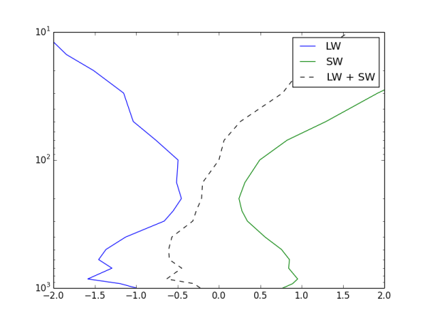

Introduction
============

pyrrtm is a python wrapper around the `rapid radiative transfer model
(RRTM) <http://rtweb.aer.com/rrtm_frame.html>`_. The longwave and
shortwave models are handled by two classes, :class:`LW` and
:class:`SW`. This package aims to be a flexible and lightweight
wrapper, and attribute names mirror the variable names in the
underlying FORTRAN codes. Usage should be familiar to anyone with
experience of the RRTM codes, and relatively straightforward to those
without.

Here is a short example of both the longwave and shortwave codes in
action::

  import pyrrtm
  import numpy
  import scipy.io.netcdf as netcdf
  import pylab
  
  nc = netcdf.netcdf_file('testprofiles.nc', 'r')
  T = nc.variables['temp'][:]
  H2O = nc.variables['h2o'][:]
  O3 = nc.variables['o3'][:]
  p = nc.variables['press'][:]
  nc.close()
  
  lw = pyrrtm.LW()
  lw.tavel = T
  lw.pavel = p
  lw.set_species('H2O', H2O, 'mmr')
  lw.set_species('co2', 0.000358, 'vmr')
  lw.set_species('o3', O3, 'vmr')
  lw.tbound = T[0]
  lw_output = lw.run()
  
  sw = pyrrtm.SW()
  sw.tavel = T
  sw.pavel = p
  sw.set_species('H2O', H2O, 'mmr')
  sw.set_species('co2', 0.000358, 'vmr')
  sw.set_species('o3', O3, 'vmr')
  sw_output = sw.run()
  
  pylab.plot(lw_output.htr, p, label="LW")
  pylab.plot(sw_output.htr[:,0], p, label="SW")
  pylab.plot(lw_output.htr + sw_output.htr[:,0], p, 
             "k--", label="LW + SW")
  pylab.legend()
  pylab.xlim(-2, 2)
  pylab.semilogy()
  pylab.ylim(1000, 10)

This example computes the heating rate profiles due to long- and
shortwave radiation, and plots profiles of these quantities. The
datafile `testprofiles.nc` is available in the `test` directory. The
result is shown here:

